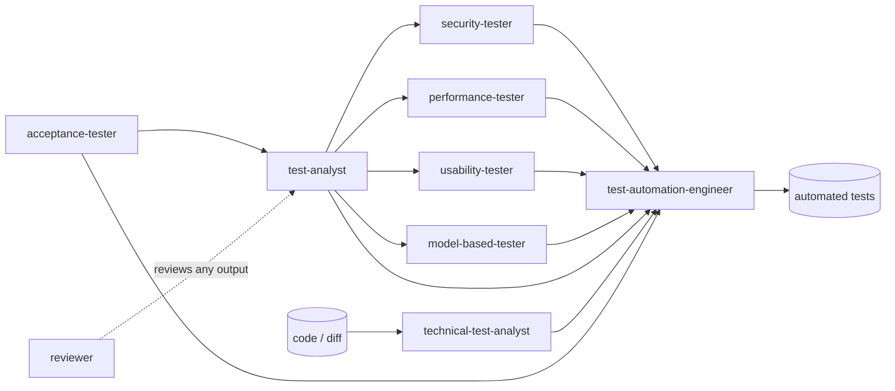

**BEWARE!** This hasn't been thoroughly verified as properly operational, so use at your own discretion and always verify results.

# Quality Assurance Agents

A [Claude Code](https://code.claude.com) plugin with nine **test role agents** whose methods
are based on the **ISTQB® syllabi**. Each agent covers one role's work. It reads Markdown
input (stories, acceptance criteria, specs, code) and writes a Markdown document. Every agent
uses the **same ID scheme**, so traceability holds from acceptance criteria to risks, test
conditions and test cases, and all the way to automated tests.

> **Disclaimer.** ISTQB® is a registered trademark of the International Software Testing
> Qualifications Board. This project is **not affiliated with, endorsed by, or certified by
> ISTQB®**. The agent instructions are original work. They name and refer to the ISTQB®
> syllabi and ISTQB® Glossary as sources, and they reproduce no syllabus content. For the
> authoritative material, see [istqb.org](https://istqb.org).

## Agents

| Agent | Based on | Input → output | Tools |
|---|---|---|---|
| `acceptance-tester` | ISTQB® Acceptance Testing, CTFL v4.0 | Rough stories → refined, testable acceptance criteria (Given/When/Then), example maps, acceptance tests (UAT, OAT, contractual/regulatory, alpha/beta), readiness verdict | read/write |
| `test-analyst` | ISTQB® CTFL v4.0, CTAL-TA v4.0 | Acceptance criteria → review findings, risk analysis, test conditions, high-level test cases, traceability matrix | read/write |
| `security-tester` | ISTQB® Security Tester; OWASP ASVS / Top 10 / API Top 10 / WSTG, STRIDE, CWE | Stories, architecture, code → assets and trust boundaries, threat model, security risks, security test design | read/write |
| `usability-tester` | ISTQB® Usability Testing; ISO 9241-11/-110, ISO/IEC 25010, WCAG 2.2 | Stories, prototypes, screenshots → heuristic evaluation, accessibility review, usability test plan | read/write |
| `performance-tester` | ISTQB® Performance Testing; ISO/IEC 25010 | NFRs, architecture, usage data → operational and load profiles, test types, metrics and thresholds | read/write |
| `model-based-tester` | ISTQB® Model-Based Tester | Workflows, lifecycles → validated models (Mermaid + YAML), selection criteria, derived tests, model coverage | read/write |
| `technical-test-analyst` | ISTQB® CTAL-TTA | Code or diff → runs the project's **existing** coverage and static analysis tools (JaCoCo, IntelliJ IDEA exports, Vitest/Istanbul, lcov, PIT, SpotBugs, PMD, ESLint, SARIF…), risk-based white-box test design | read/write + **Bash** |
| `test-automation-engineer` | ISTQB® CTAL-TAE | Any role's test cases → automation design, low-level test cases, **test code** in the project's frameworks, execution results | read/write + **Bash** |
| `reviewer` | ISTQB® CTFL v4.0 (static testing), ISO/IEC 20246 | Any work product, including the other agents' output → review report (findings log, checklist, metrics, exit recommendation) | read/write |

### Pipeline



You don't have to use the whole pipeline. Each agent works on its own.

## Design principles

- **No invented requirements.** Anything missing from the input becomes a finding, an
  assumption or an open question, and each one is labelled.
- **Design agents only design.** The security tester never attacks a system, the performance
  tester never generates load, and the usability tester never claims to have observed users.
- **Coverage figures come from tools, not the model.** The technical test analyst reports
  coverage and analysis numbers only from deterministic tools, and cites the command and
  report each number came from.
- **The project's conventions win.** The test automation engineer follows your repository's
  `CLAUDE.md` / `AGENTS.md` / testing docs. It never weakens an assertion to make a test pass;
  a mismatch is logged as a suspected defect instead.
- **Inputs are never modified.** Each agent writes its own output file. When you run an agent
  again, it updates that file and keeps the existing IDs.

## Shared ID scheme

This summary comes from the `qa-id-scheme` skill, which is preloaded into every agent.

| Prefix | Meaning |
|---|---|
| `AC-` | Acceptance criterion (never qualified) |
| `F-` | Finding |
| `ASM-` | Assumption |
| `R-` | Product risk |
| `TCO-` | Test condition |
| `TC-` | Test case |

The test-analyst is the base role and uses plain IDs (`TC-01`). The other roles add a
qualifier: `SEC`, `ACC`, `UX`, `MBT`, `REV`, `PERF`, `TECH`, `AUTO` (e.g. `TC-SEC-04`,
`R-PERF-02`). The full rules and the role-specific IDs are in
[`skills/qa-id-scheme/SKILL.md`](skills/qa-id-scheme/SKILL.md).

## Installation

```bash
# in Claude Code
/plugin marketplace add danielpmichalski/quality-assurance-agents
/plugin install quality-assurance-agents@quality-assurance-agents
```

Or test it locally without installing:

```bash
claude --plugin-dir /path/to/quality-assurance-agents
```

## Usage

Ask Claude Code in plain language, or mention an agent directly:

```text
Use the test-analyst agent on docs/stories/checkout.md
Have the acceptance-tester refine stories/PROJ-123.md, then the test-analyst design tests from its output
Run the technical-test-analyst on the diff master...HEAD
Ask the test-automation-engineer to automate TC-03, TC-SEC-02 and TC-SEC-05 from checkout.test-design.md
Have the reviewer inspect checkout.test-design.md against docs/stories/checkout.md
```

The plugin's agents are namespaced, e.g. `quality-assurance-agents:test-analyst`.

## License

[MIT](LICENSE) © 2026 Daniel Klimuntowski (Archont Soft)
